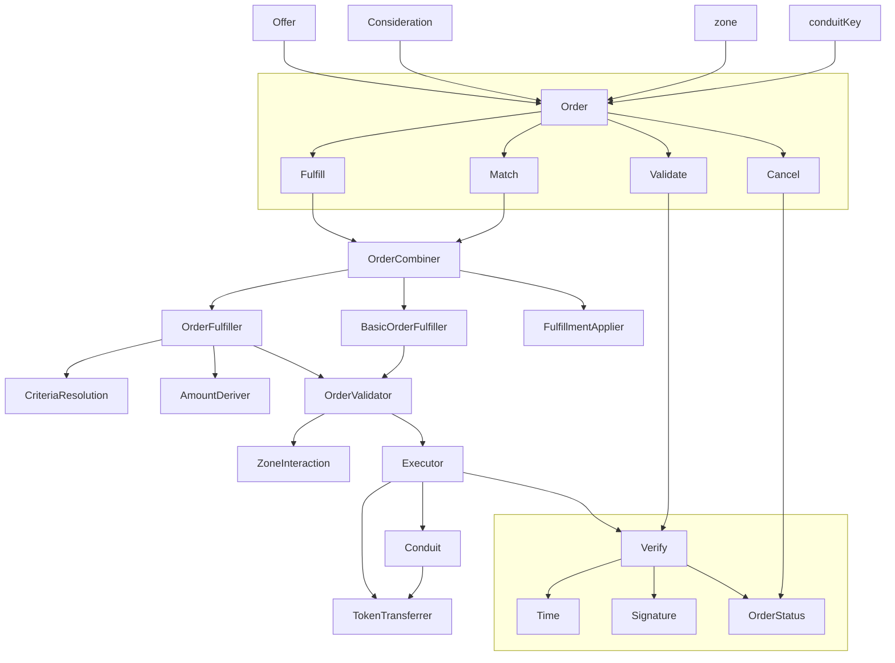

[![Version][version-badge]][version-link]
[![Test CI][ci-badge]][ci-link]
[![Code Coverage][coverage-badge]][coverage-link]
[![License][license-badge]][license-link]
[![Docs][docs-badge]][docs-link]
[![Discussions][discussions-badge]][discussions-link]
[![JS Library][js-library-badge]][js-library-link]
[![Discord][discord-badge]][discord-link]

# Seaport

Seaport is a new marketplace protocol for safely and efficiently buying and selling NFTs.

## Table of Contents

- [Seaport](#seaport)
  - [Table of Contents](#table-of-contents)
  - [Background](#background)
  - [Deployments](#deployments)
  - [Diagram](#diagram)
  - [Install](#install)
  - [Usage](#usage)
    - [Foundry Tests](#foundry-tests)
    - [Linting](#linting)
  - [Audits](#audits)
  - [Contributing](#contributing)
  - [License](#license)

## Background

Seaport is a marketplace protocol for safely and efficiently buying and selling NFTs. Each listing contains an arbitrary number of items that the offerer is willing to give (the "offer") along with an arbitrary number of items that must be received along with their respective receivers (the "consideration").

See the [documentation](docs/SeaportDocumentation.md), the [interface](contracts/interfaces/SeaportInterface.sol), and the full [interface documentation](https://docs.opensea.io/v2.0/reference/seaport-overview) for more information on Seaport.

## Deployments

### Canonical Cross-chain Deployment Addresses

<table>
<tr>
<th>Contract</th>
<th>Canonical Cross-chain Deployment Address</th>
</tr>
<tr>
<td>Seaport 1.1</td>
<td><code>0x00000000006c3852cbEf3e08E8dF289169EdE581</code></td>
</tr>
<tr>
<td>Seaport 1.2</td>
<td><code>0x00000000000006c7676171937C444f6BDe3D6282</code></td>
</tr>
<tr>
<td>ConduitController</td>
<td><code>0x00000000F9490004C11Cef243f5400493c00Ad63</code></td>
</tr>
</table>

### Deployments By EVM Chain

<table>
<tr>
<th>Network</th>
<th>Seaport 1.1</th>
<th>Seaport 1.2</th>
<th>ConduitController</th>
</tr>

<tr><td>Ethereum</td><td>

[0x00000000006c3852cbEf3e08E8dF289169EdE581](https://etherscan.io/address/0x00000000006c3852cbEf3e08E8dF289169EdE581#code)

</td><td>

[0x00000000000006c7676171937C444f6BDe3D6282](https://etherscan.io/address/0x00000000000006c7676171937C444f6BDe3D6282#code)

</td><td>

[0x00000000F9490004C11Cef243f5400493c00Ad63](https://etherscan.io/address/0x00000000F9490004C11Cef243f5400493c00Ad63#code)

</td></tr>

<tr><td>Rinkeby</td><td>

[0x00000000006c3852cbEf3e08E8dF289169EdE581](https://rinkeby.etherscan.io/address/0x00000000006c3852cbEf3e08E8dF289169EdE581#code)

</td><td>

-

</td><td>

[0x00000000F9490004C11Cef243f5400493c00Ad63](https://rinkeby.etherscan.io/address/0x00000000F9490004C11Cef243f5400493c00Ad63#code)

</td></tr>
<tr><td>Goerli</td><td>

[0x00000000006c3852cbEf3e08E8dF289169EdE581](https://goerli.etherscan.io/address/0x00000000006c3852cbEf3e08E8dF289169EdE581#code)

</td><td>

-

</td><td>

[0x00000000F9490004C11Cef243f5400493c00Ad63](https://goerli.etherscan.io/address/0x00000000F9490004C11Cef243f5400493c00Ad63#code)

</td></tr>
<tr><td>Kovan</td><td>

[0x00000000006c3852cbEf3e08E8dF289169EdE581](https://kovan.etherscan/address/0x00000000006c3852cbEf3e08E8dF289169EdE581#code)

</td><td>

-

</td><td>

[0x00000000F9490004C11Cef243f5400493c00Ad63](https://kovan.etherscan.io/address/0x00000000F9490004C11Cef243f5400493c00Ad63#code)

</td></tr>
<tr><td>Sepolia</td><td>

[0x00000000006c3852cbEf3e08E8dF289169EdE581](https://sepolia.etherscan.io/address/0x00000000006c3852cbEf3e08E8dF289169EdE581#code)

</td><td>

-

</td><td>

[0x00000000F9490004C11Cef243f5400493c00Ad63](https://sepolia.etherscan.io/address/0x00000000F9490004C11Cef243f5400493c00Ad63#code)

</td></tr>
<tr><td>Polygon</td><td>

[0x00000000006c3852cbEf3e08E8dF289169EdE581](https://polygonscan.com/address/0x00000000006c3852cbEf3e08E8dF289169EdE581#code)

</td><td>

-

</td><td>

[0x00000000F9490004C11Cef243f5400493c00Ad63](https://polygonscan.com/address/0x00000000F9490004C11Cef243f5400493c00Ad63#code)

</td></tr>
<tr><td>Mumbai</td><td>

[0x00000000006c3852cbEf3e08E8dF289169EdE581](https://mumbai.polygonscan.com/address/0x00000000006c3852cbEf3e08E8dF289169EdE581#code)

</td><td>

-

</td><td>

[0x00000000F9490004C11Cef243f5400493c00Ad63](https://mumbai.polygonscan.com/address/0x00000000F9490004C11Cef243f5400493c00Ad63#code)

</td></tr>
<tr><td>Klaytn</td><td>

[0x00000000006c3852cbEf3e08E8dF289169EdE581](https://scope.klaytn.com/address/0x00000000006c3852cbEf3e08E8dF289169EdE581#code)

</td><td>

-

</td><td>

[0x00000000F9490004C11Cef243f5400493c00Ad63](https://scope.klaytn.com/address/0x00000000F9490004C11Cef243f5400493c00Ad63#code)

</td></tr>
<tr><td>Baobab</td><td>

[0x00000000006c3852cbEf3e08E8dF289169EdE581](https://baobab.scope.klaytn.com/address/0x00000000006c3852cbEf3e08E8dF289169EdE581#code)

</td><td>

-

</td><td>

[0x00000000F9490004C11Cef243f5400493c00Ad63](https://baobab.scope.klaytn.com/address/0x00000000F9490004C11Cef243f5400493c00Ad63#code)

</td></tr>
<tr><td>Optimism</td><td>

[0x00000000006c3852cbEf3e08E8dF289169EdE581](https://optimistic.etherscan.io/address/0x00000000006c3852cbEf3e08E8dF289169EdE581#code)

</td><td>

-

</td><td>

[0x00000000F9490004C11Cef243f5400493c00Ad63](https://optimistic.etherscan.io/address/0x00000000F9490004C11Cef243f5400493c00Ad63#code)

</td></tr>
<tr><td>Optimistic Goerli</td><td>

[0x00000000006c3852cbEf3e08E8dF289169EdE581](https://goerli-optimism.etherscan.io/address/0x00000000006c3852cbEf3e08E8dF289169EdE581#code)

</td><td>

-

</td><td>

[0x00000000F9490004C11Cef243f5400493c00Ad63](https://goerli-optimism.etherscan.io/address/0x00000000F9490004C11Cef243f5400493c00Ad63#code)

</td></tr>
<tr><td>Arbitrum</td><td>

[0x00000000006c3852cbEf3e08E8dF289169EdE581](https://arbiscan.io/address/0x00000000006c3852cbEf3e08E8dF289169EdE581#code)

</td><td>

-

</td><td>

[0x00000000F9490004C11Cef243f5400493c00Ad63](https://arbiscan.io/address/0x00000000F9490004C11Cef243f5400493c00Ad63#code)

</td></tr>
<tr><td>Arbitrum Goerli</td><td>

[0x00000000006c3852cbEf3e08E8dF289169EdE581](https://goerli.arbiscan.io/address/0x00000000006c3852cbEf3e08E8dF289169EdE581#code)

</td><td>

-

</td><td>

[0x00000000F9490004C11Cef243f5400493c00Ad63](https://goerli.arbiscan.io/address/0x00000000F9490004C11Cef243f5400493c00Ad63#code)

</td></tr>
<tr><td>Arbitrum Nova</td><td>

[0x00000000006c3852cbEf3e08E8dF289169EdE581](https://nova.arbiscan.io/address/0x00000000006c3852cbEf3e08E8dF289169EdE581#code)

</td><td>

-

</td><td>

[0x00000000F9490004C11Cef243f5400493c00Ad63](https://nova.arbiscan.io/address/0x00000000F9490004C11Cef243f5400493c00Ad63#code)

</td></tr>
<tr><td>Avalanche C-Chain</td><td>

[0x00000000006c3852cbEf3e08E8dF289169EdE581](https://snowtrace.io/address/0x00000000006c3852cbEf3e08E8dF289169EdE581#code)

</td><td>

-

</td><td>

[0x00000000F9490004C11Cef243f5400493c00Ad63](https://snowtrace.io/address/0x00000000F9490004C11Cef243f5400493c00Ad63#code)

</td></tr>
<tr><td>Avalanche Fuji</td><td>

[0x00000000006c3852cbEf3e08E8dF289169EdE581](https://testnet.snowtrace.io/address/0x00000000006c3852cbEf3e08E8dF289169EdE581#code)

</td><td>

-

</td><td>

[0x00000000F9490004C11Cef243f5400493c00Ad63](https://testnet.snowtrace.io/address/0x00000000F9490004C11Cef243f5400493c00Ad63#code)

</td></tr>
<tr><td>Gnosis Chain</td><td>

[0x00000000006c3852cbEf3e08E8dF289169EdE581](https://gnosisscan.io/address/0x00000000006c3852cbEf3e08E8dF289169EdE581#code)

</td><td>

-

</td><td>

[0x00000000F9490004C11Cef243f5400493c00Ad63](https://gnossiscan.io/address/0x00000000F9490004C11Cef243f5400493c00Ad63#code)

</td></tr>
<tr><td>BSC</td><td>

[0x00000000006c3852cbEf3e08E8dF289169EdE581](https://bscscan.com/address/0x00000000006c3852cbEf3e08E8dF289169EdE581#code)

</td><td>

-

</td><td>

[0x00000000F9490004C11Cef243f5400493c00Ad63](https://bscscan.com/address/0x00000000F9490004C11Cef243f5400493c00Ad63#code)

</td></tr>
<tr><td>BSC Testnet</td><td>

[0x00000000006c3852cbEf3e08E8dF289169EdE581](https://testnet.bscscan.com/address/0x00000000006c3852cbEf3e08E8dF289169EdE581#code)

</td><td>

-

</td><td>

[0x00000000F9490004C11Cef243f5400493c00Ad63](https://testnet.bscscan.com/address/0x00000000F9490004C11Cef243f5400493c00Ad63#code)

</td></tr>
</table>

To be deployed on other EVM chains, such as:

- Skale
- Celo
- Fantom
- RSK

To deploy to a new EVM chain, follow the [steps outlined here](docs/Deployment.md).

## Diagram



For a more thorough flowchart see [Seaport diagram](./diagrams/Seaport.drawio.svg).

## Install

To install dependencies and compile contracts:

```bash
git clone https://github.com/ProjectOpenSea/seaport && cd seaport
yarn install
yarn build
```

## Usage

To run hardhat tests written in javascript:

```bash
yarn test
yarn coverage
```

> Note: artifacts and cache folders may occasionally need to be removed between standard and coverage test runs.

To run hardhat tests against reference contracts:

```bash
yarn test:ref
yarn coverage:ref
```

To open the generated Hardhat coverage report locally after running `yarn coverage` or `yarn coverage:ref`:

```bash
open coverage/index.html
```

To profile gas usage:

```bash
yarn profile
```

### Foundry Tests

Seaport also includes a suite of fuzzing tests written in solidity with Foundry.

To run tests with full traces and debugging with source, create an `.env` file with the following line:

```bash
FOUNDRY_PROFILE=debug
```

You may then run tests with `forge test`, optionally specifying a level of verbosity (anywhere from one to five `v`'s, eg, `-vvv`)

This will compile tests and contracts without `via-ir` enabled, which is must faster, but will not exactly match the deployed bytecode.

To run tests against the actual bytecode intended to be deployed on networks, you will need to pre-compile the contracts, and remove the `FOUNDRY_PROFILE` variable from your `.env` file. **Note** that informative error traces may not be available, and the Forge debugger will not show the accompanying source code.

```bash
FOUNDRY_PROFILE=optimized forge build
FOUNDRY_PROFILE=reference forge build
```

To run Forge coverage tests and open the generated coverage report locally:

```bash
brew install lcov
SEAPORT_COVERAGE=true forge coverage --report summary --report lcov && genhtml lcov.info -o html --branch
open html/index.htmlg
```

**Note** that Forge does not yet ignore specific filepaths when running coverage tests.

For information on Foundry, including installation and testing, see the [Foundry Book](https://book.getfoundry.sh/).

### Linting

To run lint checks:

```bash
yarn lint:check
```

Lint checks utilize prettier, prettier-plugin-solidity, and solhint.

```javascript
"prettier": "^2.5.1",
"prettier-plugin-solidity": "^1.0.0-beta.19",
```

## Audits

OpenSea engaged Trail of Bits to audit the security of Seaport. From April 18th to May 12th 2022, a team of Trail of Bits consultants conducted a security review of Seaport. The audit did not uncover significant flaws that could result in the compromise of a smart contract, loss of funds, or unexpected behavior in the target system. Their [full report is available here](https://github.com/trailofbits/publications/blob/master/reviews/SeaportProtocol.pdf).

## Contributing

Contributions to Seaport are welcome by anyone interested in writing more tests, improving readability, optimizing for gas efficiency, or extending the protocol via new zone contracts or other features.

When making a pull request, ensure that:

- All tests pass.
- Code coverage remains at 100% (coverage tests must currently be written in hardhat).
- All new code adheres to the style guide:
  - All lint checks pass.
  - Code is thoroughly commented with natspec where relevant.
- If making a change to the contracts:
  - Gas snapshots are provided and demonstrate an improvement (or an acceptable deficit given other improvements).
  - Reference contracts are modified correspondingly if relevant.
  - New tests (ideally via foundry) are included for all new features or code paths.
- If making a modification to third-party dependencies, `yarn audit` passes.
- A descriptive summary of the PR has been provided.

## License

[MIT](LICENSE) Copyright 2023 Ozone Networks, Inc.

[version-badge]: https://img.shields.io/github/package-json/v/ProjectOpenSea/seaport
[version-link]: https://github.com/ProjectOpenSea/seaport/releases
[ci-badge]: https://github.com/ProjectOpenSea/seaport/actions/workflows/test.yml/badge.svg
[ci-link]: https://github.com/ProjectOpenSea/seaport/actions/workflows/test.yml
[coverage-badge]: https://codecov.io/gh/ProjectOpenSea/seaport/branch/main/graph/badge.svg
[coverage-link]: https://codecov.io/gh/ProjectOpenSea/seaport
[license-badge]: https://img.shields.io/github/license/ProjectOpenSea/seaport
[license-link]: https://github.com/ProjectOpenSea/seaport/blob/main/LICENSE
[docs-badge]: https://img.shields.io/badge/Seaport-documentation-informational
[docs-link]: https://github.com/ProjectOpenSea/seaport/tree/main/docs
[discussions-badge]: https://img.shields.io/badge/Seaport-discussions-blueviolet
[discussions-link]: https://github.com/ProjectOpenSea/seaport/discussions
[js-library-badge]: https://img.shields.io/badge/Seaport.js-library-red
[js-library-link]: https://github.com/ProjectOpenSea/seaport-js
[discord-badge]: https://img.shields.io/static/v1?logo=discord&label=discord&message=Join&color=blue
[discord-link]: https://discord.gg/ADXcTXpqry
