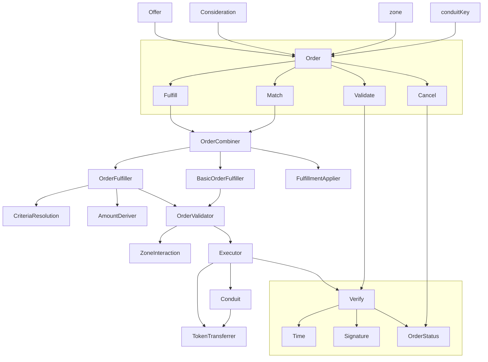

[![Version][version-badge]][version-link]
[![Test CI][ci-badge]][ci-link]
[![Code Coverage][coverage-badge]][coverage-link]
[![License][license-badge]][license-link]
[![Docs][docs-badge]][docs-link]
[![Discussions][discussions-badge]][discussions-link]
[![JS Library][js-library-badge]][js-library-link]
[![Discord][discord-badge]][discord-link]

---

# OpenSea SeaPort contest details
- Total Prize Pool: $100,500 USDC
  - HM awards: $85,000 USDC
  - QA report awards: $8,500 USDC
  - Gas report awards: $5,000 USDC
  - Judge + presort awards: $15,000 USDC
  - Scout awards: $500 USDC
- Join [C4 Discord](https://discord.gg/code4rena) to register
- Submit findings [using the C4 form](https://code4rena.com/contests/2023-01-opensea-seaport-contest/submit)
- [Read our guidelines for more details](https://docs.code4rena.com/roles/wardens)
- Starts January 13, 2023 20:00 UTC
- Ends January 23, 2023 20:00 UTC

**IMPORTANT NOTE**: Unlike most public Code4rena contests, prior to receiving payment from this contest you MUST become a Certified Warden (successfully complete KYC). You do not have to complete this process before competing or submitting bugs. **You must have started this process within 48 hours after contest close, i.e. by January 18, 2023 at 20:00 UTC in order to receive payment.**

## C4udit / Publicly Known Issues

The C4audit output for the contest can be found [here](add link to report) within an hour of contest opening.

*Note for C4 wardens: Anything included in the C4udit output is considered a publicly known issue and is ineligible for awards.*

 - Cross-domain reentrancy between zones, contract offerers, token contracts, distinct instances of Seaport or other marketplaces, or other external contracts, or view-only reentrancy on functions such as getOrderStatus or getContractOffererNonce, is "publicly known"
 - Lack of ERC721 safeTransferFrom usage in the transfer helper and on conduits is "publicly known"
 - interaction with non-compliant or malicious ERC20/ERC721/ERC1155 implementations not considered in scope
 - also see Seaport 1.1 out of scope / known limitations section: https://github.com/code-423n4/2022-05-opensea-seaport#out-of-scope

# Overview

Seaport v1.2 builds on Seaport v1.1 in a (mostly) backwards-compatible fashion, but includes a few new features and performs further optimizations on the codebase.

Contributions are welcome and encouraged; if you make any findings, we encourage you to open PRs (you will likely want to wait to make your findings public until the competition has concluded) and to add yourself as a contributor to the repo.

Gas optimizations that do not otherwise modify behavior or adversely impact safety are also welcome and encouraged. Any optimizations should be supported by an associated gas profile report (e.g. run `yarn profile`). Also, please do not submit optimizations for any of the reference contracts in `reference/` or test contracts in `contracts/test/` and `test/foundry/`, though informational findings to improve readability or cover missing test cases are more than welcome.

# Scope

 - contracts/Seaport.sol
 - contracts/lib/*
 - contracts/helpers/PointerLibraries.sol
 - contracts/interfaces/*
 - contracts/conduit/* (with the assumption that only Seaport v1.2 will be added as a channel)
 - reference/* (only considered for informational issues)

## Out of scope

- contracts/test/*
- contracts/zones/*
- test/*
- contracts/helpers/TransferHelper.sol
- contracts/helpers/TransferHelperStructs.sol
- gas optimizations not considered for reference contracts and constructor logic

# Additional Context

Seaport v1.2 builds on Seaport v1.1 with the following new characteristics:
- Contract orders do not have a signature, and instead are generated at the time of fulfillment by the contract order's offerer upon a stateful call to `generateOrder` from Seaport. The generated order must adhere to the requirements laid out by the fulfiller, namely that all of the designated offer item amounts, or greater, are returned as the offer and that all of the designated consideration item amounts, or less, are returned as the consideration. Seaport will also make a stateful call to `ratifyOrder` on the contract offerer after all transfers have been completed and must receive back the correct magic value. See the contract offerer interface for more details.
- Bulk signatures allow for signing multiple orders at once, and are fulfilled by providing the bulk signature, an index of the order being fulfilled, and a merkle proof that the order at the given index is part of the bulk signature payload. Powers of two between 2^1 and 2^24 are supported as payload sizes. If a signature is a valid size for bulk signatures, Seaport will attempt to verify it as such, falling back to standard EIP-1271 if it fails.
- Zone calls now occur after all transfers have occurred and use a single stateful `validateOrder` endpoint and must receive back the correct magic value for restricted orders to be considered valid. See the zone interface and the `ZoneParameters` struct for more details.
- Contract orders and orders being matched may designate native tokens (e.g. Ether) as offer items, and may pay provide said Ether to Seaport during fulfillment for use by the fulfiller. Any unspent native tokens will be returned to the caller.
- The `OrderValidated` event now emits the full `OrderParameters` struct as an argument, and a new `OrdersMatched` event is emitted when matching orders. A `recipient is also supplied (or inferred) as an argument when matching orders, and will be reflected in the respective `OrderFulfilled` event — this recipient will receive any unspent offer item amounts after all supplied fulfillments have been applied. Fulfillments will also now skip out-of-range items.
- Custom ABI encoding and decoding has been employed, generated by the [abi-lity](https://github.com/d1ll0n/abi-lity) codegen tool, and many other optimizations have been implemented throughout.

For more information on Seaport in general, see the [docs](https://github.com/ProjectOpenSea/seaport/tree/1.2/docs).

## Scoping Details
```
- If you have a public code repo, please share it here: https://github.com/ProjectOpenSea/seaport/tree/seaport-1.2-code4rena-competition
- How many contracts are in scope?: ~30 core contracts along with a similar # of "reference" contracts
- Total SLoC for these contracts?: ~30k
- How many external imports are there?: n/a
- How many separate interfaces and struct definitions are there for the contracts within scope?: ~30
- Does most of your code generally use composition or inheritance?: inheritance
- How many external calls?: ~10 different flavors of external call
- What is the overall line coverage percentage provided by your tests?: >90%
- Is there a need to understand a separate part of the codebase / get context in order to audit this part of the protocol?: no
- Please describe required context: n/a
- Does it use an oracle?: no
- Does the token conform to the ERC20 standard?: n/a
- Are there any novel or unique curve logic or mathematical models?: n/a
- Does it use a timelock function?: no
- Is it an NFT?: no
- Does it have an AMM?: no
- Is it a fork of a popular project?: builds on Seaport v1.1
- Does it use rollups?: no
- Is it multi-chain?: will be deployed to many EVM chains
- Does it use a side-chain?: no
```

# Tests

See [Install](#install) & [Usage](#usage) below for information on how to run tests.

-----
-----

# Seaport

Seaport is a new marketplace protocol for safely and efficiently buying and selling NFTs.

## Table of Contents

- [Seaport](#seaport)
  - [Table of Contents](#table-of-contents)
  - [Background](#background)
  - [Deployments](#deployments)
  - [Diagram](#diagram)
  - [Install](#install)
  - [Usage](#usage)
    - [Foundry Tests](#foundry-tests)
  - [Audits](#audits)
  - [Contributing](#contributing)
  - [License](#license)

## Background

Seaport is a marketplace protocol for safely and efficiently buying and selling NFTs. Each listing contains an arbitrary number of items that the offerer is willing to give (the "offer") along with an arbitrary number of items that must be received along with their respective receivers (the "consideration").

See the [documentation](https://github.com/ProjectOpenSea/seaport/blob/3acb953d9017b181965ccb080fda8d3641a2ef4c/docs/SeaportDocumentation.md), the [interface](https://github.com/ProjectOpenSea/seaport/blob/3acb953d9017b181965ccb080fda8d3641a2ef4c/contracts/interfaces/SeaportInterface.sol), and the full [interface documentation](https://docs.opensea.io/v2.0/reference/seaport-overview) for more information on Seaport.

## Deployments

<table>
<tr>
<th>Network</th>
<th>Seaport 1.1</th>
<th>ConduitController</th>
</tr>

<tr><td>Ethereum</td><td rowspan="14">

[0x00000000006c3852cbEf3e08E8dF289169EdE581](https://etherscan.io/address/0x00000000006c3852cbEf3e08E8dF289169EdE581#code)

</td><td rowspan="14">

[0x00000000F9490004C11Cef243f5400493c00Ad63](https://etherscan.io/address/0x00000000F9490004C11Cef243f5400493c00Ad63#code)

</td></tr>

<tr><td>Rinkeby</td></tr>
<tr><td>Goerli</td></tr>
<tr><td>Kovan</td></tr>
<tr><td>Sepolia</td></tr>
<tr><td>Polygon</td></tr>
<tr><td>Mumbai</td></tr>
<tr><td>Optimism</td></tr>
<tr><td>Optimistic Kovan</td></tr>
<tr><td>Arbitrum</td></tr>
<tr><td>Arbitrum Nova</td></tr>
<tr><td>Arbitrum Rinkeby</td></tr>
<tr><td>Avalanche Fuji</td></tr>
<tr><td>Avalanche C-Chain</td></tr>
<tr><td>Gnosis Chain</td></tr>
<tr><td>BSC</td></tr>
</table>

To be deployed on other EVM chains, such as:

- Klaytn
- Baobab
- Skale
- Celo
- Fantom
- RSK

To deploy to a new EVM chain, follow the [steps outlined here](https://github.com/ProjectOpenSea/seaport/blob/3acb953d9017b181965ccb080fda8d3641a2ef4c/docs/Deployment.md).

## Diagram



For a more thorough flowchart see [Seaport diagram](./diagrams/Seaport.drawio.svg).

## Install

To install dependencies and compile contracts:

```bash
git clone https://github.com/ProjectOpenSea/seaport && cd seaport
yarn install
yarn build
```

## Usage

To run hardhat tests written in javascript:

```bash
yarn test
yarn coverage
```

> Note: artifacts and cache folders may occasionally need to be removed between standard and coverage test runs.

To run hardhat tests against reference contracts:

```bash
yarn test:ref
yarn coverage:ref
```

To profile gas usage:

```bash
yarn profile
```

### Foundry Tests

Seaport also includes a suite of fuzzing tests written in solidity with Foundry.

To install Foundry (assuming a Linux or macOS system):

```bash
curl -L https://foundry.paradigm.xyz | bash
```

This will download foundryup. To start Foundry, run:

```bash
foundryup
```

To install dependencies:

```
forge install
```

To precompile contracts:

The optimized contracts are compiled using the IR pipeline, which can take a long time to compile. By default, the differential test suite deploys precompiled versions of both the optimized and reference contracts. Precompilation can be done by specifying specific Foundry profiles.

```bash
FOUNDRY_PROFILE=optimized forge build
FOUNDRY_PROFILE=reference forge build
```

There are three Foundry profiles for running the test suites, which bypass the IR pipeline to speed up compilation. To run tests, run any of the following:

```bash
FOUNDRY_PROFILE=test forge test # with 5000 fuzz runs
FOUNDRY_PROFILE=lite forge test # with 1000 fuzz runs
FOUNDRY_PROFILE=local forge test # compiles and deploys ReferenceConsideration normally, with 1000 fuzz runs
FOUNDRY_PROFILE=debug forge test # compiles and deploys Consideration and ReferenceConsideration using default profile solc settings, not from precompiled source, with 1000 fuzz runs
```

You may wish to include a `.env` file that `export`s a specific profile when developing locally.

**Note** that stack+debug traces will not be available for precompiled contracts. To facilitate local development, specifying `FOUNDRY_PROFILE=local` will compile and deploy the reference implementation normally, allowing for stack+debug traces.

**Note** the `local` profile uses Forge's `ffi` flag. `ffi` can potentially be unsafe, as it allows Forge to execute arbitrary code. Use with caution, and always ensure you trust the code in this repository, especially when working on third-party forks.

The following modifiers are also available:

- Level 2 (-vv): Logs emitted during tests are also displayed.
- Level 3 (-vvv): Stack traces for failing tests are also displayed.
- Level 4 (-vvvv): Stack traces for all tests are displayed, and setup traces for failing tests are displayed.
- Level 5 (-vvvvv): Stack traces and setup traces are always displayed.

```bash
FOUNDRY_PROFILE=test forge test  -vv
```

For more information on foundry testing and use, see [Foundry Book installation instructions](https://book.getfoundry.sh/getting-started/installation.html).

To run lint checks:

```bash
yarn lint:check
```

Lint checks utilize prettier, prettier-plugin-solidity, and solhint.

```javascript
"prettier": "^2.5.1",
"prettier-plugin-solidity": "^1.0.0-beta.19",
```

## Audits

OpenSea engaged Trail of Bits to audit the security of Seaport. From April 18th to May 12th 2022, a team of Trail of Bits consultants conducted a security review of Seaport. The audit did not uncover significant flaws that could result in the compromise of a smart contract, loss of funds, or unexpected behavior in the target system. Their [full report is available here](https://github.com/trailofbits/publications/blob/master/reviews/SeaportProtocol.pdf).

## Contributing

Contributions to Seaport are welcome by anyone interested in writing more tests, improving readability, optimizing for gas efficiency, or extending the protocol via new zone contracts or other features.

When making a pull request, ensure that:

- All tests pass.
- Code coverage remains at 100% (coverage tests must currently be written in hardhat).
- All new code adheres to the style guide:
  - All lint checks pass.
  - Code is thoroughly commented with natspec where relevant.
- If making a change to the contracts:
  - Gas snapshots are provided and demonstrate an improvement (or an acceptable deficit given other improvements).
  - Reference contracts are modified correspondingly if relevant.
  - New tests (ideally via foundry) are included for all new features or code paths.
- If making a modification to third-party dependencies, `yarn audit` passes.
- A descriptive summary of the PR has been provided.

## License

[MIT](LICENSE) Copyright 2023 Ozone Networks, Inc.

[version-badge]: https://img.shields.io/github/package-json/v/ProjectOpenSea/seaport
[version-link]: https://github.com/ProjectOpenSea/seaport/releases
[ci-badge]: https://github.com/ProjectOpenSea/seaport/actions/workflows/test.yml/badge.svg
[ci-link]: https://github.com/ProjectOpenSea/seaport/actions/workflows/test.yml
[coverage-badge]: https://codecov.io/gh/ProjectOpenSea/seaport/branch/main/graph/badge.svg
[coverage-link]: https://codecov.io/gh/ProjectOpenSea/seaport
[license-badge]: https://img.shields.io/github/license/ProjectOpenSea/seaport
[license-link]: https://github.com/ProjectOpenSea/seaport/blob/main/LICENSE
[docs-badge]: https://img.shields.io/badge/Seaport-documentation-informational
[docs-link]: https://github.com/ProjectOpenSea/seaport/tree/1.2/docs
[discussions-badge]: https://img.shields.io/badge/Seaport-discussions-blueviolet
[discussions-link]: https://github.com/ProjectOpenSea/seaport/discussions
[js-library-badge]: https://img.shields.io/badge/Seaport.js-library-red
[js-library-link]: https://github.com/ProjectOpenSea/seaport-js
[discord-badge]: https://img.shields.io/static/v1?logo=discord&label=discord&message=Join&color=blue
[discord-link]: https://discord.gg/ADXcTXpqry
