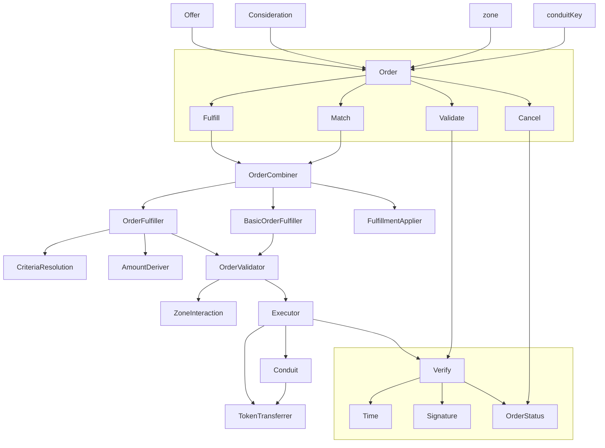

# Seaport

Seaport is a new marketplace protocol for safely and efficiently buying and selling NFTs.

## Deployment instructions
`npm run deploy:rinkeby`

### Etherscan verification
ConduitController:

`npx hardhat verify --network rinkeby 0xBf320C8539386d7eEc20C547F4d0456354a9f2c5`

Seaport:

`npx hardhat verify --network rinkeby 0x8644e0f67c55a8db5d89D92371ED842fff16A5c5 "0xBf320C8539386d7eEc20C547F4d0456354a9f2c5"`

### Latest test deployments
Rinkeby:
- ConduitController: https://rinkeby.etherscan.io/address/0xBf320C8539386d7eEc20C547F4d0456354a9f2c5
- Seaport: https://rinkeby.etherscan.io/address/0x8644e0f67c55a8db5d89D92371ED842fff16A5c5

Optimism Kovan:
- ConduitController: https://kovan-optimistic.etherscan.io/address/0xB94Ad2559dCC53Da3a51B9f62eB9254fd0fB389D
- Seaport: https://kovan-optimistic.etherscan.io/address/0x5d603b86fA18de1e6a95a2f890cE1aEf2f641839

Polygon Mumbai
- ConduitController: https://mumbai.polygonscan.com/address/0xB94Ad2559dCC53Da3a51B9f62eB9254fd0fB389D
- Seaport: https://mumbai.polygonscan.com/address/0x5d603b86fA18de1e6a95a2f890cE1aEf2f641839

## Table of Contents

- [Seaport](#seaport)
  - [Deployment instructions](#deployment-instructions)
    - [Etherscan verification](#etherscan-verification)
    - [Latest test deployments](#latest-test-deployments)
  - [Table of Contents](#table-of-contents)
  - [Background](#background)
  - [Deployments](#deployments)
  - [Diagram](#diagram)
  - [Install](#install)
  - [Usage](#usage)
    - [Foundry Tests](#foundry-tests)
  - [Audits](#audits)
  - [Contributing](#contributing)
  - [License](#license)

## Background

Seaport is a marketplace protocol for safely and efficiently buying and selling NFTs. Each listing contains an arbitrary number of items that the offerer is willing to give (the "offer") along with an arbitrary number of items that must be received along with their respective receivers (the "consideration").

See the [documentation](docs/SeaportDocumentation.md), the [interface](contracts/interfaces/SeaportInterface.sol), and the full [interface documentation](https://docs.opensea.io/v2.0/reference/seaport-overview) for more information on Seaport.

## Deployments

Seaport 1.1 deployment addresses:

| Network          | Address                                    |
| ---------------- | ------------------------------------------ |
| Ethereum Mainnet | [0x00000000006c3852cbEf3e08E8dF289169EdE581](https://etherscan.io/address/0x00000000006c3852cbEf3e08E8dF289169EdE581#code) |
| Rinkeby          | [0x00000000006c3852cbEf3e08E8dF289169EdE581](https://rinkeby.etherscan.io/address/0x00000000006c3852cbEf3e08E8dF289169EdE581#code) |

Conduit Controller deployment addresses:

| Network          | Address                                    |
| ---------------- | ------------------------------------------ |
| Ethereum Mainnet | [0x00000000F9490004C11Cef243f5400493c00Ad63](https://etherscan.io/address/0x00000000F9490004C11Cef243f5400493c00Ad63#code) |
| Rinkeby          | [0x00000000F9490004C11Cef243f5400493c00Ad63](https://rinkeby.etherscan.io/address/0x00000000F9490004C11Cef243f5400493c00Ad63#code) |

## Diagram



For a more thorough flowchart see [Seaport diagram](./diagrams/Seaport.drawio.svg).

## Install

To install dependencies and compile contracts:

```bash
git clone https://github.com/ProjectOpenSea/seaport && cd seaport
yarn install
yarn build
```

## Usage

To run hardhat tests written in javascript:

```bash
yarn test
yarn coverage
```

> Note: artifacts and cache folders may occasionally need to be removed between standard and coverage test runs.

To run hardhat tests against reference contracts:

```bash
yarn test:ref
yarn coverage:ref
```

To profile gas usage:

```bash
yarn profile
```

### Foundry Tests

Seaport also includes a suite of fuzzing tests written in solidity with Foundry.

To install Foundry (assuming a Linux or macOS system):

```bash
curl -L https://foundry.paradigm.xyz | bash
```

This will download foundryup. To start Foundry, run:

```bash
foundryup
```

To install dependencies:

```
forge install
```

To precompile contracts:

The optimized contracts are compiled using the IR pipeline, which can take a long time to compile. By default, the differential test suite deploys precompiled versions of both the optimized and reference contracts. Precompilation can be done by specifying specific Foundry profiles.

```bash
FOUNDRY_PROFILE=optimized forge build
FOUNDRY_PROFILE=reference forge build
```

There are three Foundry profiles for running the test suites, which bypass the IR pipeline to speed up compilation. To run tests, run any of the following:

```bash
FOUNDRY_PROFILE=test forge test # with 5000 fuzz runs
FOUNDRY_PROFILE=lite forge test # with 1000 fuzz runs
FOUNDRY_PROFILE=local-ffi forge test # compiles and deploys ReferenceConsideration normally, with 1000 fuzz runs
```

You may wish to include a `.env` file that `export`s a specific profile when developing locally.

**Note** that stack+debug traces will not be available for precompiled contracts. To facilitate local development, specifying `FOUNDRY_PROFILE=local-ffi` will compile and deploy the reference implementation normally, allowing for stack+debug traces.

**Note** the `local-ffi` profile uses Forge's `ffi` flag. `ffi` can potentially be unsafe, as it allows Forge to execute arbitrary code. Use with caution, and always ensure you trust the code in this repository, especially when working on third-party forks.


The following modifiers are also available:

- Level 2 (-vv): Logs emitted during tests are also displayed.
- Level 3 (-vvv): Stack traces for failing tests are also displayed.
- Level 4 (-vvvv): Stack traces for all tests are displayed, and setup traces for failing tests are displayed.
- Level 5 (-vvvvv): Stack traces and setup traces are always displayed.

```bash
FOUNDRY_PROFILE=test forge test  -vv
```

For more information on foundry testing and use, see [Foundry Book installation instructions](https://book.getfoundry.sh/getting-started/installation.html).

To run lint checks:

```bash
yarn lint:check
```

Lint checks utilize prettier, prettier-plugin-solidity, and solhint.

```javascript
"prettier": "^2.5.1",
"prettier-plugin-solidity": "^1.0.0-beta.19",
```

## Audits

OpenSea engaged Trail of Bits to audit the security of Seaport. From April 18th to May 12th 2022, a team of Trail of Bits consultants conducted a security review of Seaport. The audit did not uncover significant flaws that could result in the compromise of a smart contract, loss of funds, or unexpected behavior in the target system. Their [full report is available here](https://github.com/trailofbits/publications/blob/master/reviews/SeaportProtocol.pdf).

## Contributing

Contributions to Seaport are welcome by anyone interested in writing more tests, improving readability, optimizing for gas efficiency, or extending the protocol via new zone contracts or other features.

When making a pull request, ensure that:

- All tests pass.
- Code coverage remains at 100% (coverage tests must currently be written in hardhat).
- All new code adheres to the style guide:
	- All lint checks pass.
	- Code is thoroughly commented with natspec where relevant.
- If making a change to the contracts:
	- Gas snapshots are provided and demonstrate an improvement (or an acceptable deficit given other improvements).
	- Reference contracts are modified correspondingly if relevant.
	- New tests (ideally via foundry) are included for all new features or code paths.
- If making a modification to third-party dependencies, `yarn audit` passes.
- A descriptive summary of the PR has been provided.

## License

[MIT](LICENSE) Copyright 2022 Ozone Networks, Inc.

